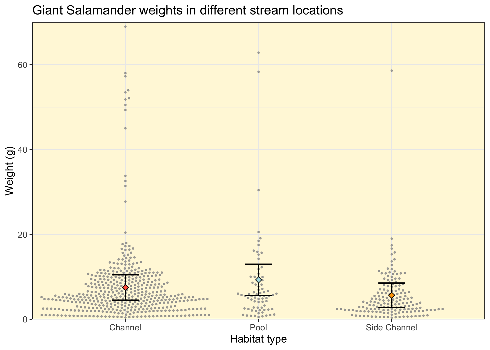

```{r setup, include = FALSE}
knitr::opts_chunk$set(echo = FALSE, include = FALSE)
```


```{r packages}
# Load packages

library(tidyverse)
library(janitor)
library(kableExtra)
library(ggbeeswarm)
library(ggridges)
library(effsize)
library(car)
```

```{r read and clean data}
# Read in data...only keep salamander (DITE species) and year, section, unittype(where in the channel salamanders are found) and weight columns.

sal_data <- read_csv("mack_creek_vertebrates.csv") %>%
  clean_names() %>% 
  filter(species == "DITE") %>% 
  select(c(year, section, unittype, weight))
  
```

```{r counts for section}

# Count salamander observations per year

sal_counts <- sal_data %>%
  group_by(year, section) %>% 
  count()

# Plot these data...

sal_counts_graph <- ggplot(data = sal_counts, aes(x = year, y = n, color = section)) +
  geom_line() +
  
  theme_bw() +
  
  scale_x_continuous(expand = c(0,0)) +
  
  scale_color_manual(values = c("darkgoldenrod1", "darkolivegreen"),
                     labels = c("Clear cut", "Old growth")) +
  
  scale_y_continuous(expand = c(0,0), 
                     limits = c(0, 400)) +
    
  theme(panel.background = element_rect(fill = "cornsilk"),
        legend.title = NULL) +
  
  labs(x = NULL, y = "Salamanders counted", title = "Salamander counts per year in clear cut and old growth forest")


ggsave("sal_counts.png", plot = sal_counts_graph)

```


```{r salamander counts}
# Filter out Isolated Pool (IP) observations, select for only year 2017, count data

channel_counts <- sal_data %>% 
  filter(unittype == c("P", "C", "SC", "S", "R")) %>%
  filter(year == "2017") %>%
  group_by(section, unittype) %>% 
  count()

# Note that there are only counts recorded for C, SC, and P stream locations

# Make a contingency table

channel_table <- channel_counts %>%
  pivot_wider(names_from = section, values_from = n) %>% 
  column_to_rownames("unittype")

# Then adorn with proportions

channel_prop <- channel_table %>% 
  rownames_to_column("unittype") %>% 
  adorn_percentages(denominator = "row") %>% 
  adorn_pct_formatting(digits = 2) %>% 
  adorn_ns(position = "front")

# Then make a table

channel_kable <- kable(channel_prop, 
      col.names = c("", "Clear Cut", "Old Growth")) %>% 
  kable_styling(bootstrap_options = c("striped")) %>% 
  add_header_above(header = c("Salamander counts by forest type and stream location" = 3))

channel_kable

```

```{r chi-squared for channel position}

channel_chi <- chisq.test(channel_table)

channel_chi

```


```{r Salamander weights in forest section}
# Make new df for weights in 2017

sal_weights <- sal_data %>% 
  filter(year == "2017") %>% 
  select(-unittype) 

# Then look at these data...

weight_dist <- ggplot(data = sal_weights, aes(x = weight, fill = section)) +
  geom_histogram() +
  
  facet_wrap("section") +
  
  theme_bw() +
  
  scale_fill_manual(values = c("darkgoldenrod1", "darkolivegreen")) +
  
  scale_y_continuous(expand = c(0,0),
                     limits = c(0, 125)) +
  
  scale_x_continuous(expand = c(0,0)) +
  
  theme(panel.background = element_rect(fill = "cornsilk"),
        legend.position = "none") +

  labs(x = "Weight(g)", y = "Count", title = "Weight measurement distribution by forest type")

ggsave("weight_dist.png", plot = weight_dist)


# A bit skewed. Let's look at a QQ plot...

ggplot(data = sal_weights, aes(sample = weight)) +
  geom_qq() +
  facet_wrap("section")

# Pretty skewed. But, the prompt asks to compare means...so...
# Split CC and OG sections into separate data frames...

og_weight <- sal_weights %>% 
  filter(section == "OG")

cc_weight <- sal_weights %>% 
  filter(section == "CC")

# Look at a few summary statistics...

og_summary <- og_weight %>% 
  summarize(mean = mean(og_weight$weight, na.rm = TRUE)) %>% 
  mutate(sd = sd(og_weight$weight, na.rm = TRUE)) %>% 
  mutate(median = median(og_weight$weight, na.rm = TRUE))

cc_summary <- cc_weight %>% 
  summarize(mean = mean(cc_weight$weight, na.rm = TRUE)) %>% 
  mutate(sd = sd(cc_weight$weight, na.rm = TRUE)) %>% 
  mutate(median = median(cc_weight$weight, na.rm = TRUE))

# Then, do a parametric test on the means

section_wt_t <- t.test(og_weight$weight, cc_weight$weight)

section_wt_t

```

```{r weights by channel position}

# First, make a df for just 2017 weights

chan_wt <- sal_data %>% 
  filter(year == "2017") %>% 
  select(-section) %>% 
  filter(unittype == c("C", "P", "SC"))

chan_wt_summary <- chan_wt %>% 
  group_by(unittype) %>% 
  summarize(mean = mean(weight),
            sd = sd(weight),
            se = sqrt(sd))


# Then, graph these data...

sal_weights_graph <- ggplot() +
  geom_beeswarm(data = chan_wt, 
                aes(x = unittype, y = weight),
                color = "grey60",
                alpha = 0.8,
                cex = 1.5
                ) +
  
  geom_errorbar(data = chan_wt_summary,
                aes(x = unittype,
                    ymin = mean - se,
                    ymax = mean + se),
                width = 0.2,
                size = .7,
                color = "black") +

  geom_point(data = chan_wt_summary, 
             aes(x = unittype,
                 y = mean,
                 fill = unittype),
             size = 2,
             shape = 23) +
  
  scale_fill_manual(values = c("tomato", "powderblue", "orange")
                    ) +
  
  theme_bw() +
  
  theme(panel.background = element_rect(fill= "cornsilk", color = "red"),
        legend.position = "none") +
  
  scale_y_continuous(expand = c(0,0),
                     limits = c(0, 70)) +
  
  scale_x_discrete(labels = c("Channel", "Pool", "Side Channel")) +
  
  labs(x = "Habitat type", y = "Weight (g)", title = "Giant Salamander weights in different stream locations")

ggsave("sal_weights.png", plot = sal_weights_graph)
```


```{r ANOVA for location weights}
# First, lets see if our null hypothesis of equal variance is true...

leveneTest(weight ~ unittype, data = chan_wt)

# Because variances are equal, we can continue with an ANOVA

weight_aov <- aov(weight ~ unittype, data = chan_wt)

summary(weight_aov)

weight_list <- unlist(summary(weight_aov))

weight_aov_tidy <- broom::tidy(weight_aov)

TukeyHSD(weight_aov)
weight_tukey_tidy <- broom::tidy(TukeyHSD(weight_aov))

```


## Introduction


## Data and methods

Salamander weight measurements and abundance data were collected and provided by the [Andrews Experimental Forest Long Term Environmental Research Program.](https://portal.lternet.edu/nis/mapbrowse?packageid=knb-lter-and.4027.12) Vertibrate stream surveys were conducted yearly via 50m electroshocking passes in two standard 150m reaches of forest: one old growth, and one clear cut (ca. 1963). 50m pass sections were separated with nets during sampling. Captured vertibrates from these passes were weighed and counted. Salamander location was recorded as cascade, riffle, isolated pool, pool, rapid, step, or side channel.

Salamander counts were compared for forest type and stream location using a $\chi$^2^ test ($\alpha$ = 0.5 throughout). Mean weights were compared between forest types using a two-sample t-test. Mean weights were compared between stream types using a one-way ANOVA. Assumptions of equal variance for weight samples between different stream types were confirmed using Levene's test. 

MAP

## Results

### A. 

Salamander counts in old growth and clear cut sections of forest were compared over time. Generally, salamander abundance in old growth sections of forest exceeds abundance in clear cut sections of forest. However, since 2015, counts in clear cut sections have surpassed those in old growth sections of forest.  


### B. 

`r channel_kable`
**Table 1.** *Counts of where salamanders were observed, by forest type (Clear cut or old growth) and stream location (Channel, pool, or side channel). Percentages refer to proportion of counts in each forest type, by stream location.*


### C. 

Salamanders were most often found in channels (n = 89), followed by side channels (n = 33), and then pools (n = 17). Forest type had no significant effect on where salamanders reside in streams ($\chi$^2^ (`r round(channel_chi$parameter, 2)`) = `r round(channel_chi$statistic, 2)`, *p* = `r round(channel_chi$p.value, 2)`). 

### D. 

Forest type also had no significant effect on salamander weights (t(`r round(section_wt_t$parameter, 2)`) = `r round(section_wt_t$statistic, 2)`, *p* = `r round(section_wt_t$p.value, 2)` However, on average, salamanders found in clear cut sections of forest weighed over a gram more (mean = 7.8g) than salamanders in old growth sections (mean = 6.7g). Data was widely spread in both forest types (clear cut sd = 9.0g, old growth sd = 9.9g), reducing robustness of the parametric test used. This is likely due to strong positive skew in weight data, where just a few salamanders weighed significantly more than the mean (Figure 2.).


### E.

The heaviest salamanders were all found in stream channels (Fig. 3), though stream location did not have a significant effect on salamander size (one-way ANOVA(`r weight_list[1]`, `r weight_list[2]`) = `r round(weight_list[7], 2)`, *p* = `r round(weight_list[9], 2)`). Salamanders found in channels were almost twice as heavy (mean = 8.2g) as those found in side channels (mean = 4.8g). 

Weight measurements for salamanders found in channels are positively skewed. Comparing medians between groups, rather than means, may better describe differences between groups, as medians are less affected by skew than means. This would mainly effect the mean of salamanders found in channels, which have a few uncharacteristically heavy individuals pulling the mean heavier.



## Summary

## References


